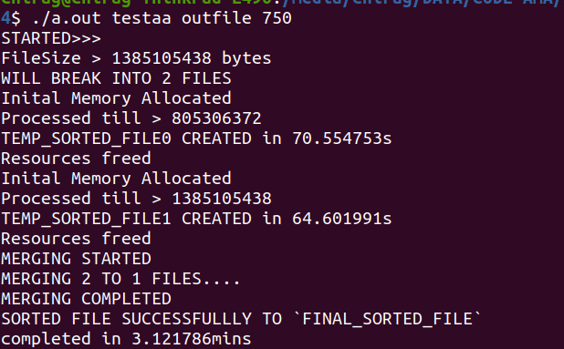
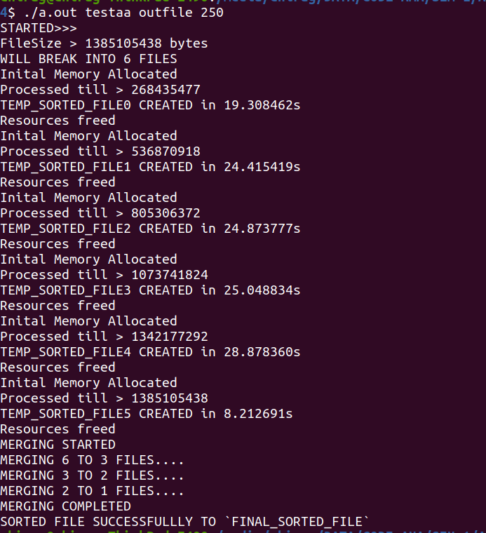

# sort-large-file
Code written in C to sort a very large file (xxGB)

#### Instructions to compile and run 
```
$ gcc sort-large-file-code.c -o sort-large-file-code
$ ./sort-large-file-code <INPUT_FILE> <OUTPUT_FILE> <LOADING_SCHEME>

```

#### Program have 2 loadings
<b>i.e</b> will load specific amount of data into RAM at a time<br>
:- <b>750MB</b> loading & <b>250MB</b> loading<br>
750MB - when avg size of word is large (i.e range 1-100 or <)<br>
250MB - when avg size of word is not that large

**750Mb loading Tests : 128Mb > 12s | 1.3Gb > 3Mins | 6.4Gb > 23Mins 15s <br>: Random generated data with word size 1-100**

<p align="center">
  
  <br>
  <br>
  
</p>

***#Time printed is calculated a bit wrong (don't know why)***<br>
***<LOADING_SCHEME> -> {750, 250} for respective loadings***


# data-builder.c
Code written in C to build randomly generated data (xxGB)

#### Instructions to compile and run 
```
$ gcc data-builder.c -o data-builder
$ ./data-builder

```
Have to input an arguement (let it be inp)
and will generate a file containing 1024x1024xinp words

For eg :- Input 10 to generate a file containg 1024x1024x10 words. 

